# Theme Worlds

[](https://github.com/MarlenMM/theme-worlds/actions/workflows/ci.yml)
[](https://marlenmm.github.io/theme-worlds/)
[](https://colab.research.google.com/github/MarlenMM/theme-worlds/blob/main/notebook/theme_worlds.ipynb)
[](results/seam_ratios.md)
[](#what-the-notebook-loads)
[](LICENSE)

Seamless 360° panoramas from **stock Stable Diffusion v1.5**: wide images whose
left and right edges are the same edge. A MultiDiffusion sampler written from
scratch, with **circular windows**, makes the loop a property of the sampling
rather than something stitched afterwards, and **multi-branch conditioning**
lets two themes share one world without either prompt being truncated.

No training, no LoRA, **zero source images**. Every pixel comes from the
original SD v1.5 weights, on a free Colab T4.

<p align="center">
  
</p>

*One panorama (arctic ice cave + cozy village, seed 1002) scrolling sideways
forever. The white notches mark where the PNG's left and right edges meet;
nothing else about that column gives it away.*

**Live viewer: <https://marlenmm.github.io/theme-worlds/>**: the panoramas
wrapped around a cylinder. Drag to look around, and turn on *Show file edge* to
find where each file begins.

Built for the Visual Content Contest, the mini-project of KAIST AIC.20000
*Introduction to AI Computing* (Fall 2026). The [write-up](docs/writeup/theme-worlds-writeup.pdf)
and [slides](docs/slides/theme-worlds-slides.pdf) are in `docs/`.

### Measured

| | | | |
|---|---|---|---|
| Mean seam ratio, 28 panoramas | **1.12** | Seam with circular windows off → on | **7.94 → 1.05** (7.6×) |
| Tokens CLIP silently drops from a fused two-theme prompt | **20 of 97** | Cost of `compose` vs a single branch | **1.53×** |
| Seam ratio: this sampler vs diffusers' reference | **0.99 vs 0.95** | Same seeds, two separate Colab sessions | **byte-identical PNGs** |

The **seam ratio** is `mean|first column − last column|` divided by the mean
difference between *neighbouring* columns. About 1 means the wrap-around join
is statistically indistinguishable from any other pair of adjacent columns; a
strip merely cropped to size scores 5–15. The seam ratios and the byte-identical
reproduction are re-measured from the output PNGs by
[`scripts/measure_seams.py`](scripts/measure_seams.py), with every panorama
listed in [`results/seam_ratios.md`](results/seam_ratios.md). The ablation, cost
and reference figures come from paired control renders the notebook saves with
each run (12, 9 and 12 pairs) and are tabulated in the write-up.

---

## Gallery

<p align="center">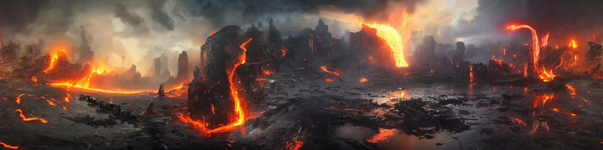</p>
<p align="center"><sub><b>Volcanic lava world + flooded metropolis</b> · seed 201 · 2048×512 · seam ratio 0.88</sub></p>

<p align="center">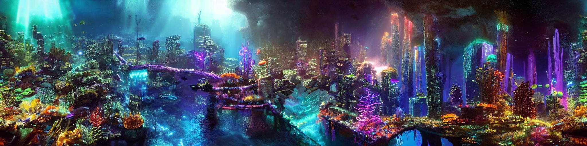</p>
<p align="center"><sub><b>Cyberpunk + underwater</b> · seed 1001 · 2048×512 · seam ratio 1.34</sub></p>

<p align="center">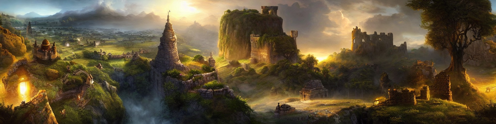</p>
<p align="center"><sub><b>Floating-island fantasy + medieval kingdom</b> · seed 1001 · 2048×512 · seam ratio 1.19</sub></p>

<p align="center">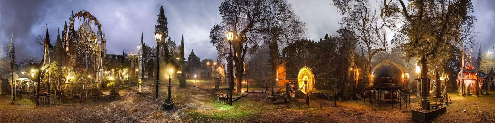</p>
<p align="center"><sub><b>Gothic cathedral courtyard + abandoned amusement park</b> · seed 455 · 2048×512 · seam ratio 0.61</sub></p>

<p align="center">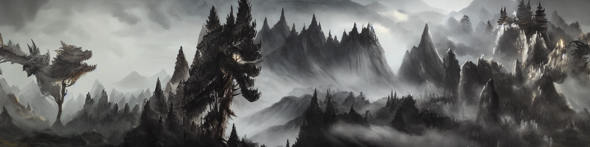</p>
<p align="center"><sub><b>Ink wash mountains + dragon spires</b> · seed 201 · 2048×512 · seam ratio 1.27</sub></p>

Ten worlds are in the [live viewer](https://marlenmm.github.io/theme-worlds/),
and all 31 output PNGs at full resolution (28 distinct images plus the three
byte-identical reproductions) are attached to the
[v1.0 release](https://github.com/MarlenMM/theme-worlds/releases/tag/v1.0).

---

## How it works

SD v1.5 was trained at 512×512. Asked directly for 2048×512 it paints roughly
four 512-ish scenes glued together, with duplicated skylines and warped
geometry, and nothing in the model makes the left edge agree with the right.

**MultiDiffusion** ([Bar-Tal et al., ICML 2023](https://arxiv.org/abs/2302.08113))
keeps one shared latent canvas, cuts it into overlapping 64×64-latent windows
(512×512 px, exactly the shape SD v1.5 was trained on), runs an ordinary
denoising step on each, and averages every window's opinion back into the
canvas at every step. No weight is touched and no tensor ever exceeds 64×64
latents, which is why a 2048×512 world fits on a free T4. One step of the
sampler in [the notebook](notebook/theme_worlds.ipynb) (Step 5):

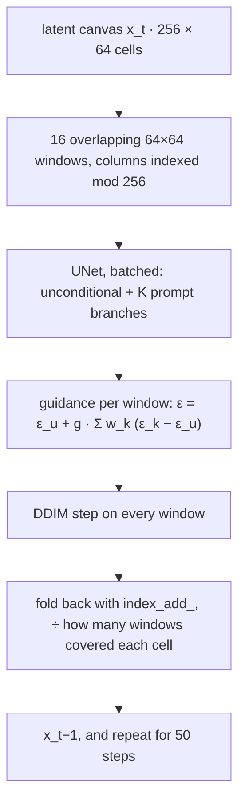

Two extensions on top of the published method:

**1. Circular windows: the loop.** The window list wraps, and each window
indexes its columns with `torch.arange(w0, w1) % latent_w`, so a window that
starts near the right edge continues onto the left. Both ends of the canvas
share windows from the first step and are denoised as one surface; nothing is
stitched afterwards. The VAE decoder has a receptive field of its own, so 8
latent columns are wrapped around each side before decoding and the
corresponding 64 px cropped off afterwards.

**2. Multi-branch conditioning: two themes, no truncation.** The obvious way to
combine two themes is one long prompt. Measured, a fused
`cyberpunk + medieval` prompt is **97 tokens** against CLIP's hard
**77-token** context, so 20 tokens are discarded without warning, and what is
cut is the tail: the quality suffix, every time. So the sampler never
concatenates. It takes *K* conditioning branches, each with its own embedding
per window, and one UNet call carries the unconditional pass plus all *K*,
combined in noise space as in composable diffusion
([Liu et al., ECCV 2022](https://arxiv.org/abs/2206.01714)). Four strategies
differ only inside `build_conditioning`, so everything downstream is shared and
the comparison below is fair:

| Mode | What it does | Cost |
|---|---|---|
| **`compose`** (default) | both prompts act on every pixel, each at full length | 1.53× |
| `regions` | each theme owns one side of the loop, joined by a circular raised-cosine hand-off | 1× |
| `blend` | one averaged embedding everywhere | 1× |
| `single_prompt` | the naive concatenation, kept as a control | 1× |

**Fitting a free T4.** MultiDiffusion calls `scheduler.step()` once per window,
out of order, so the scheduler must be stateless. DDIM is; SD v1.5's default
PNDM would silently corrupt its own history, so the notebook swaps it and
asserts the swap. The UNet runs in fp16, but the fusion accumulator is fp32,
because averaging several overlapping fp16 predictions per cell is exactly
where rounding shows up as banding. The stride is exposed (16 rather than the
reference's hard-coded 8, halving the work), and initial noise is drawn on the
**CPU** generator, whose RNG is identical across GPUs; that is why a seed
reproduces byte-for-byte on a different machine.

## What the controls showed

The notebook renders its own controls, one variable at a time, from the same
seed. These are `cyberpunk + underwater` at 1024×512 and 30 steps.

<table>
  <tr>
    <td width="50%">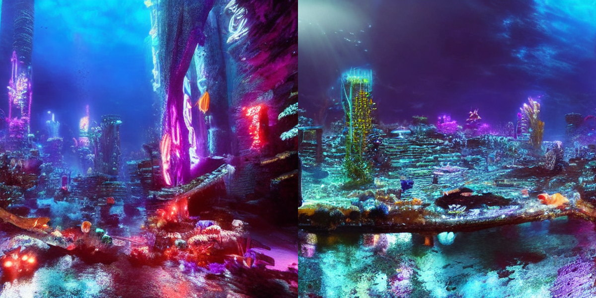<br><sub><b>Circular windows off</b>, rolled 50% so the join sits mid-frame · seam ratio <b>6.39</b></sub></td>
    <td width="50%">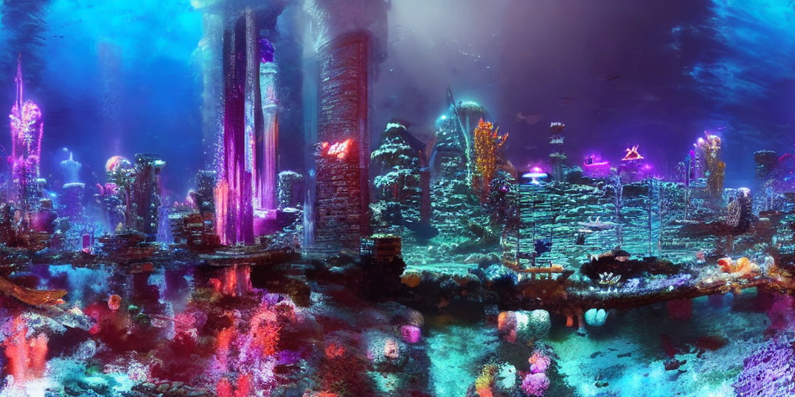<br><sub><b>On</b>, same seed, rolled the same way · seam ratio <b>0.97</b></sub></td>
  </tr>
  <tr>
    <td>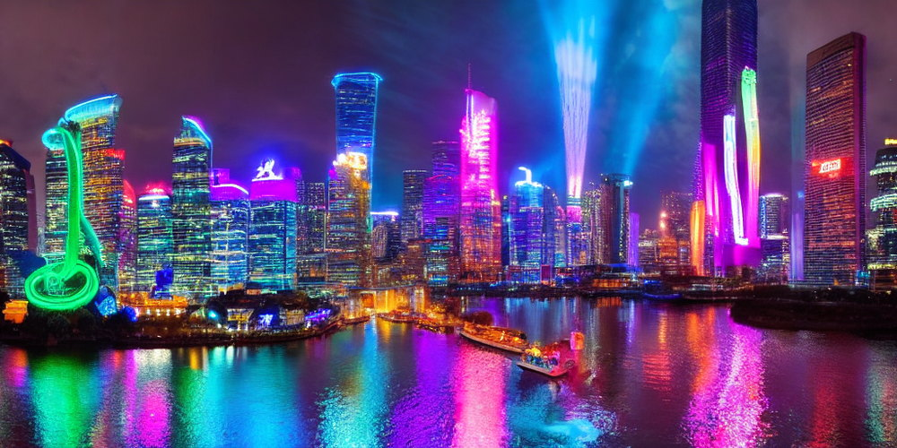<br><sub><b><code>single_prompt</code></b>: a dry skyline; the reef is gone</sub></td>
    <td>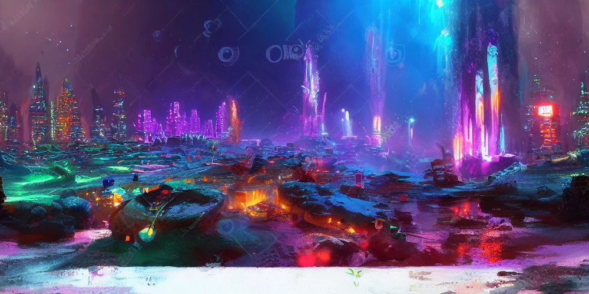<br><sub><b><code>blend</code></b>: a washed-out midpoint, neither city nor reef</sub></td>
  </tr>
  <tr>
    <td>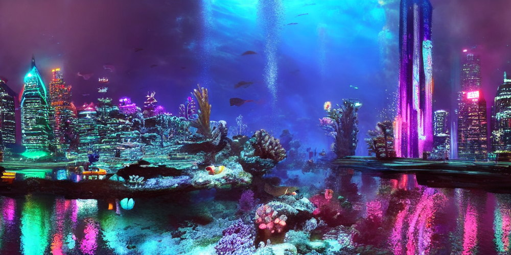<br><sub><b><code>regions</code></b>: reef through the centre, towers at both ends</sub></td>
    <td>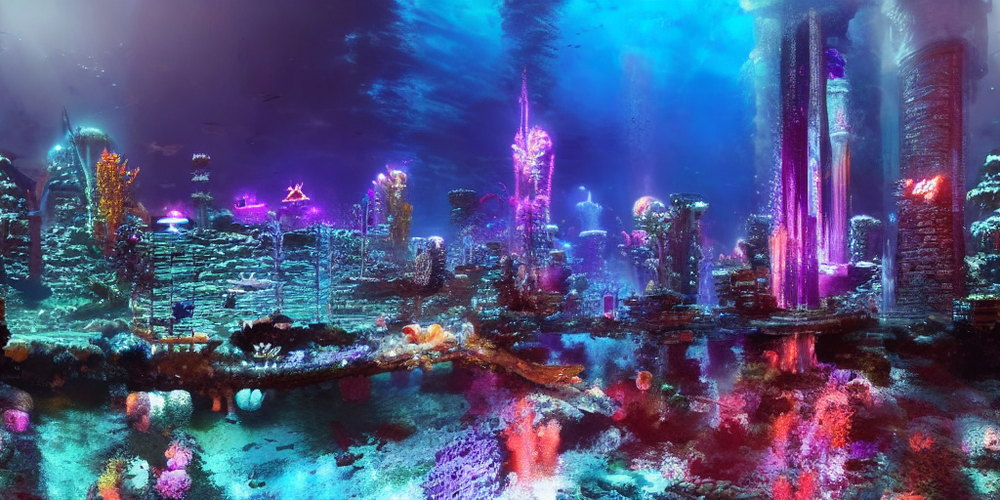<br><sub><b><code>compose</code></b>: coral-encrusted neon towers, the only true hybrid</sub></td>
  </tr>
</table>

- **Circular windows are doing the work.** Over 12 paired runs the seam ratio
  averaged 7.94 with wrapping off (5.01–14.63) and 1.05 with it on (0.72–1.36):
  never less than a 5.4× improvement on identical inputs.
- **Tokenisation, not attention, is what kills fused prompts.** I expected
  `single_prompt` to blur the two themes; it deletes one, and the token count
  says why. Measuring the prompt beat staring at the image.
- **The re-implementation behaves like the published method.** Against
  diffusers' own `StableDiffusionPanoramaPipeline` on the same checkpoint, seed
  and canvas, seam ratios are indistinguishable over 12 pairs (0.95 ± 0.22
  reference, 0.99 ± 0.22 mine).
- **And it surfaced a bug in the reference.** With `circular_padding=True`
  that pipeline scatters each finished window back using *canvas* row indices
  rather than window-local ones, so any canvas taller than one window crashes
  with a shape mismatch, and it is unmaintained past diffusers 0.33.1. This
  sampler never addresses a window by canvas coordinates, which is why the
  1536×768 worlds work.

Candidates are chosen by numbers rather than taste: CLIP ViT-L/14 scores six
square crops taken *around the loop*, a theme's score is its best crop, a
candidate's score is the **worse** of its two themes (penalising one that
quietly dropped a theme), and anything with a seam ratio above 4 is
disqualified.

## Constraints that shaped it

The course allowed exactly one generative model, and a violation scored zero,
so several obvious library choices were off the table:

- **Only SD v1.5 may produce pixels.** No SDXL, no third-party SD v1.5
  checkpoint, LoRA or upscaler. The diffusers docs example for its panorama
  pipeline loads `stabilityai/stable-diffusion-2-base`, and copying it would
  have been an instant zero. A test asserts that every `from_pretrained` call in
  the notebook loads one of the two permitted weights.
- **Auxiliary models may guide but not generate.** CLIP is used only as a judge
  of finished images, and switching it off (`USE_CLIP_RANKING = False`) leaves
  the notebook working.
- **Up to 10 source images.** Zero were used; there is no upload step.
- **One `.ipynb`, run end to end on a Colab T4, saved with every output**, and
  it must reproduce the submitted images. The notebook here is that
  submission, with its outputs intact.

## What the notebook loads

| Weight | Role | Source |
|---|---|---|
| Stable Diffusion v1.5 (fp16) | **Generates every pixel.** Ships its own CLIP ViT-L/14 text encoder, VAE and scheduler config. | [`stable-diffusion-v1-5/stable-diffusion-v1-5`](https://huggingface.co/stable-diffusion-v1-5/stable-diffusion-v1-5) |
| CLIP ViT-L/14 | Scores finished images only; generates nothing. Optional. | [`openai/clip-vit-large-patch14`](https://huggingface.co/openai/clip-vit-large-patch14) |

The SD safety checker is deliberately not loaded: it generates nothing, costs
~1.2 GB of VRAM, and returns black images on false positives, a real risk for
stylised landscape art.

## Run it

**Generate a world on Colab.** Open the notebook with the badge above, pick
*Runtime → Change runtime type → T4 GPU*, then *Run all*. The only cell you
need to edit is Step 6: one or two of the 50 themes (plus a `custom` slot), the
fusion mode, canvas size and seeds. A 2048×512 candidate at 50 steps took 177 s
on a T4 with `compose`, and single-branch modes run in about two-thirds of
that. Step 2 mounts Google Drive
so outputs survive the session; set `USE_DRIVE = False` to skip that.

**Run the tests and scripts locally.** No GPU and no model downloads are
needed. Python 3.10 or newer, and the CPU build of torch to avoid a ~2 GB CUDA
download:

```bash
python3 -m venv .venv && .venv/bin/pip install torch --index-url https://download.pytorch.org/whl/cpu
```

```bash
.venv/bin/pip install -r requirements-dev.txt
```

```bash
.venv/bin/python -m pytest
```

To re-measure the seam ratios or rebuild the media, point the scripts at a
folder of notebook outputs, such as the unzipped release asset:

```bash
.venv/bin/python scripts/measure_seams.py path/to/outputs
```

```bash
.venv/bin/python scripts/make_media.py path/to/outputs
```

### How the tests work

The deliverable had to be one self-contained notebook, so the sampler lives in
its cells and nowhere else, and there is no second copy of it in a package that
could drift. [`scripts/notebook_code.py`](scripts/notebook_code.py) pulls the
definitions out of the `.ipynb` source, and the tests execute *those* on a CPU
against a stub pipeline: a tiny UNet with zero-padded convolutions, so a
window's border behaves differently from its interior just as in the real
network, and the real diffusers `DDIMScheduler` with SD v1.5's settings. Among
what they pin down:

- rolling the starting noise sideways rolls the result by exactly the same
  amount with circular windows, and **not** without them, which is what
  "the loop is a property of the sampling" means;
- composing a prompt with itself is identical to ordinary guidance, and
  composition weights of 1 and 0 reduce to the first theme alone;
- every column of a circular canvas is covered by the same number of windows;
- a seed reproduces exactly, and the VAE's circular padding is cropped back to
  the requested canvas size;
- the notebook loads only the two permitted weights, draws its noise on the CPU
  generator, and was saved after a single top-to-bottom run.

## Limitations

- **Composition is seed-sensitive.** SD v1.5's model card flags multi-object
  compositionality as a weak point: with distant concepts some seeds land on a
  genuine hybrid and others on a compromise that reads as neither. That is why
  each run renders several seeds and ranks them.
- **High-contrast pairs cancel under `compose`.** `volcanic_lava_world +
  arctic_ice_cave` is better served by `regions`, where each theme keeps its own
  territory.
- **The seam ratio certifies the wrap, not semantic continuity.** A world can
  loop perfectly and still change mood across the frame.
- **Object-level fidelity stays SD v1.5's.** Small figures and animals in the
  busier worlds are often malformed under magnification; no sampling schedule
  fixes that.
- **CI does not run the notebook on a GPU.** It runs the notebook's sampler
  code on a stub pipeline; the evidence that the real pipeline works is the
  saved outputs and the byte-identical reproduction across Colab sessions.

## Layout

| Path | Purpose |
|---|---|
| [`notebook/theme_worlds.ipynb`](notebook/theme_worlds.ipynb) | The project: theme menu, sampler, controls, CLIP ranking, run metadata. Saved with its Colab outputs |
| [`docs/writeup/`](docs/writeup/) | Write-up PDF and its LaTeX source |
| [`docs/slides/`](docs/slides/) | Contest slides PDF and the HTML they are printed from |
| [`docs/index.html`](docs/index.html) | The live 360° viewer (GitHub Pages) |
| [`docs/media/`](docs/media/) | README and viewer media, generated by `scripts/make_media.py` |
| [`results/`](results/) | Re-measured seam ratio for every panorama, and the reproduction MD5s |
| [`scripts/`](scripts/) | Notebook-code loader, seam measurement, media builder |
| [`tests/`](tests/) | Sampler properties and notebook structure checks, run in CI |

A note on what changed from the submitted files: the notebook's widget progress
bars and duplicate PNG encodings of its figures were removed (Colab stores every
figure as both PNG and JPEG; the JPEG copy is kept) so that GitHub can render
it, and the student number was removed from the notebook (one field of the run
metadata in Step 11), the write-up and the slides. Nothing else in the code,
outputs or results was changed.

## References

- O. Bar-Tal, L. Yariv, Y. Lipman, T. Dekel. *MultiDiffusion: Fusing Diffusion Paths for Controlled Image Generation.* ICML 2023. [arXiv:2302.08113](https://arxiv.org/abs/2302.08113)
- N. Liu, S. Li, Y. Du, A. Torralba, J. B. Tenenbaum. *Compositional Visual Generation with Composable Diffusion Models.* ECCV 2022. [arXiv:2206.01714](https://arxiv.org/abs/2206.01714)
- R. Rombach, A. Blattmann, D. Lorenz, P. Esser, B. Ommer. *High-Resolution Image Synthesis with Latent Diffusion Models.* CVPR 2022. [arXiv:2112.10752](https://arxiv.org/abs/2112.10752)
- J. Song, C. Meng, S. Ermon. *Denoising Diffusion Implicit Models.* ICLR 2021. [arXiv:2010.02502](https://arxiv.org/abs/2010.02502)
- J. Ho, T. Salimans. *Classifier-Free Diffusion Guidance.* NeurIPS 2021 Workshop. [arXiv:2207.12598](https://arxiv.org/abs/2207.12598)
- A. Radford et al. *Learning Transferable Visual Models From Natural Language Supervision.* ICML 2021. [arXiv:2103.00020](https://arxiv.org/abs/2103.00020)

## License

The code in this repository is MIT-licensed. The Stable Diffusion v1.5 weights
are not included; they are distributed under the CreativeML OpenRAIL-M licence,
whose use restrictions also apply to images generated with them.
